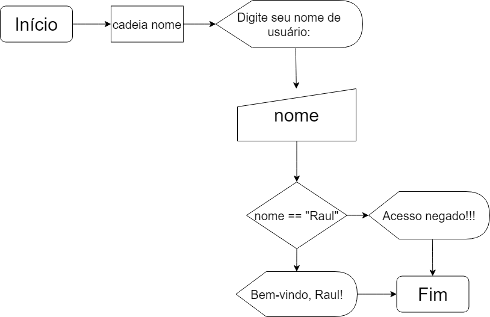

# Lógica de Programação
- Exercícios de Lógica de Programação.
- Segue abaixo o exemplo de README para os trabalhos de grupo.

# LP-Grupos (Exemplo)
 ## :detective: Índice

* Sobre o Projeto
* Tecnologias utilizadas
* Fluxograma
* Autores do Projeto

## Sobre o Projeto
O projeto visa o desenvolvimento...
	
Algumas funcionalidades do sistema são:
* Tela de...

O projeto foi realizado durante o período aproximado de 5 dias, durante a disciplina de Programação Orientada a Objetos da Residência em TIC/Software do Serratec.

##  Tecnologias utilizadas
- [Portugol](https://univali-lite.github.io/Portugol-Studio/)

##  Fluxograma

## Autores

- [Débora Souza](https://github.com/debysouza)
